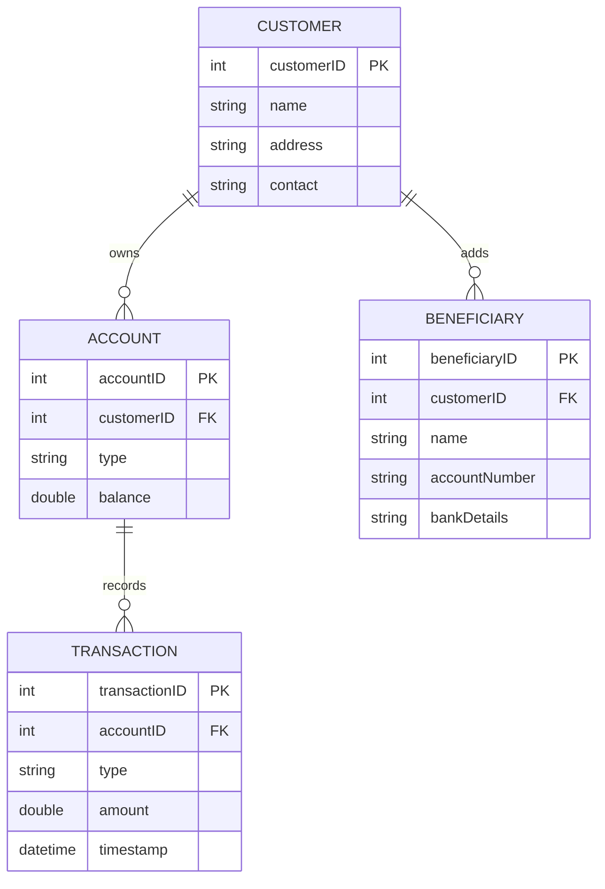
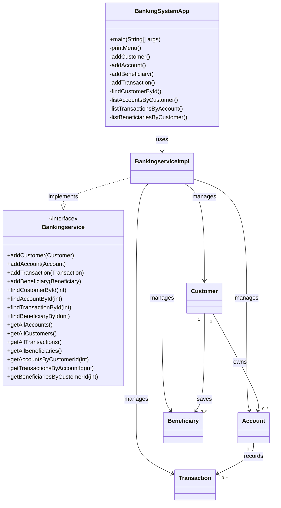
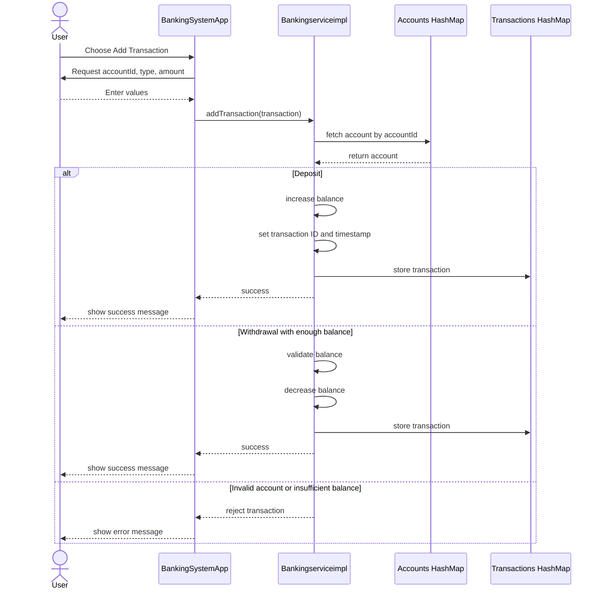
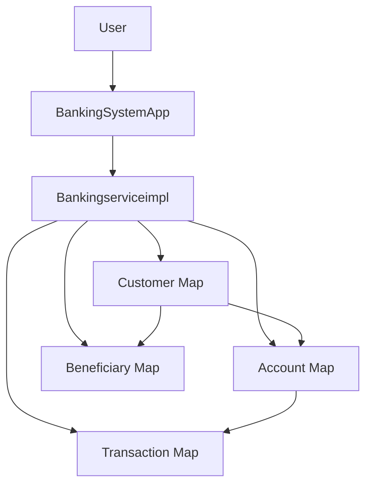

# Banking Service Management System

> A Core Java mini project that models customer, account, beneficiary, and transaction operations through a menu-driven console application.

## Overview
This project is a Core Java banking case study built to demonstrate how real-world banking entities can be modeled using object-oriented programming and the Java Collections Framework. The application runs in the console and allows the user to create customers, manage accounts, add beneficiaries, process deposit and withdrawal transactions, and retrieve relationship-based reports.

The codebase is small, clean, and focused on Core Java fundamentals, which makes it a good training project as well as a solid GitHub portfolio artifact for Java basics.

## Submission Snapshot
| Item | Details |
|---|---|
| Project Title | Banking Service Management System |
| Project Type | Core Java Mini Project |
| Package | `com.tnsif.bankingservice` |
| Module | `ucet_codes` |
| Interface Used | `Bankingservice` |
| Implementation Class | `Bankingserviceimpl` |
| Entry Point | `BankingSystemApp` |
| Storage Model | In-memory `HashMap` collections |
| Input Method | `Scanner` |
| Timestamp Handling | `LocalDateTime` |

## Why This Project Stands Out
- Models a practical banking workflow instead of isolated syntax examples.
- Uses interface-driven design to separate contract from implementation.
- Demonstrates entity relationships between customer, account, beneficiary, and transaction.
- Applies business rules such as balance validation during withdrawal.
- Uses collection-based storage for fast ID-based retrieval.
- Presents the system with diagrams and architecture notes suitable for trainer review.

## Project Objective
The main goal of this project is to build a basic banking management system in Java that can:
- register customers
- create bank accounts
- add beneficiaries
- process deposits and withdrawals
- search customer records
- display linked accounts, transactions, and beneficiaries

## Core Java Concepts Demonstrated
- Classes and objects
- Encapsulation
- Abstraction through interface design
- Collection Framework usage
- Menu-driven console programming
- Object relationships
- Basic transaction validation logic
- Modular project structure

## Features
- Add customer details
- Add account details for a customer
- Add beneficiary details linked to a customer
- Process deposit transactions
- Process withdrawal transactions
- Auto-generate transaction IDs
- Capture transaction timestamp automatically
- Find customer by ID
- List all accounts for a customer
- List all transactions for an account
- List all beneficiaries for a customer

## Business Problem Solved
Banks manage multiple connected entities. A single customer can own multiple accounts, maintain multiple beneficiaries, and perform many transactions over time. This project simulates that structure in a simplified Core Java environment and shows how those relationships can be managed without a database by using object-oriented design and collections.

## Functional Modules
### 1. Customer Management
Stores and retrieves customer details.

### 2. Account Management
Creates bank accounts and links them to customers using `customerID`.

### 3. Beneficiary Management
Stores transfer beneficiary details associated with a customer.

### 4. Transaction Management
Processes deposit and withdrawal requests for accounts and records transaction history.

### 5. Search and Reporting
Supports customer lookup and relationship-based listing of accounts, transactions, and beneficiaries.

## Architecture Summary
The application follows a simple layered flow:

`User -> BankingSystemApp -> Bankingservice interface -> Bankingserviceimpl -> HashMap-based storage`

### Layer Roles
- `BankingSystemApp` handles menu display, input collection, and output messages.
- `Bankingservice` defines the service contract.
- `Bankingserviceimpl` contains the business logic and collection operations.
- Entity classes hold project data.

## Source Files and Responsibilities
### `Customer.java`
Represents a customer in the banking system.

Fields:
- `customerID`
- `name`
- `address`
- `Contact`

Responsibilities:
- store customer data
- provide getters and setters
- provide `toString()`

### `Account.java`
Represents a customer bank account.

Fields:
- `accountID`
- `customerID`
- `type`
- `balance`

Responsibilities:
- store account details
- connect an account to a customer
- provide getters and setters

### `Beneficiary.java`
Represents a saved beneficiary linked to a customer.

Fields:
- `beneficiaryID`
- `customerID`
- `name`
- `accountNumber`
- `bankDetails`

Responsibilities:
- store beneficiary information
- associate beneficiary with customer

### `Transaction.java`
Represents account activity such as deposit or withdrawal.

Fields:
- `transactionID`
- `accountID`
- `type`
- `amount`
- `timestamp`

Responsibilities:
- store transaction details
- keep transaction amount and type
- record timestamp

### `Bankingservice.java`
Defines the service operations exposed by the banking system.

Key methods:
- `addCustomer(Customer customer)`
- `addAccount(Account account)`
- `addTransaction(Transaction transaction)`
- `addBeneficiary(Beneficiary beneficiary)`
- `findCustomerById(int id)`
- `findAccountById(int id)`
- `findTransactionById(int id)`
- `findBeneficiaryById(int id)`
- `getAllAccounts()`
- `getAllCustomers()`
- `getAllTransactions()`
- `getAllBeneficiaries()`
- `getAccountsByCustomerId(int customerId)`
- `getTransactionsByAccountId(int accountId)`
- `getBeneficiariesByCustomerId(int customerId)`

### `Bankingserviceimpl.java`
Implements all service methods using `HashMap` collections.

Internal collections:
- `Map<Integer, Customer> customers`
- `Map<Integer, Account> accounts`
- `Map<Integer, Transaction> transactions`
- `Map<Integer, Beneficiary> beneficiaries`

Important business logic:
- auto-increments transaction IDs using `transactionCounter`
- assigns `LocalDateTime.now()` during transaction creation
- increases balance for deposits
- decreases balance for withdrawals only when balance is sufficient
- rejects transactions if account is not found

### `BankingSystemApp.java`
Contains the `main()` method and menu-driven workflow.

Responsibilities:
- print menu options
- take user input using `Scanner`
- call service operations
- display output to the console

### `package-info.java`
Declares package information for `com.tnsif.bankingservice`.

## Menu Flow
The application menu supports the following operations:

1. Add Customers
2. Add Accounts
3. Add Beneficiary
4. Add Transaction
5. Find Customer by Id
6. List all Accounts of specific Customer
7. List all transactions of specific Account
8. List all beneficiaries of specific customer
9. Exit

## End-to-End Working Sequence
1. The user starts the application.
2. The main menu is displayed.
3. The user selects one operation.
4. The program collects required inputs.
5. The app delegates work to the service layer.
6. The service layer updates or retrieves records from in-memory collections.
7. The result is displayed in the console.
8. The loop continues until Exit is selected.

## File Structure
```text
ucet_codes/
|-- src/
|   |-- module-info.java
|   `-- com/
|       `-- tnsif/
|           `-- bankingservice/
|               |-- Account.java
|               |-- Bankingservice.java
|               |-- Bankingserviceimpl.java
|               |-- BankingSystemApp.java
|               |-- Beneficiary.java
|               |-- Customer.java
|               |-- Transaction.java
|               `-- package-info.java
`-- bin/
    `-- com/
        `-- tnsif/
            `-- bankingservice/
                |-- Account.class
                |-- Bankingservice.class
                |-- Bankingserviceimpl.class
                |-- BankingSystemApp.class
                |-- Beneficiary.class
                |-- Customer.class
                |-- Transaction.class
                |-- package-info.class
                `-- README.md
```

## Data Design
This project uses `HashMap` collections for storing records during runtime.

### Why `HashMap` Was Chosen
- fast search by primary ID
- easy insertion and retrieval
- suitable for demo-scale in-memory systems
- clearly demonstrates collection operations in Core Java

## Entity Relationship Diagram


## Class Interaction Diagram


## Sequence Diagram


## Interaction Diagram


## Use Case Summary
- A user can register a new customer.
- A user can create one or more accounts for a customer.
- A user can add one or more beneficiaries for a customer.
- A user can perform deposit and withdrawal transactions on an account.
- A user can search and view related data through ID-based reporting.

## Input and Output Summary
### Input
The application accepts:
- customer ID
- account ID
- beneficiary ID
- names
- address
- contact number
- account type
- beneficiary account number
- beneficiary bank details
- transaction type
- amount

### Output
The application displays:
- success messages
- customer search result
- account listing
- transaction listing with timestamp
- beneficiary listing
- validation messages for invalid account and insufficient balance

## Business Rules Implemented
- transaction ID is generated automatically
- transaction timestamp is captured automatically
- withdrawal is allowed only when the balance is sufficient
- transaction fails if the account does not exist
- all data exists only during program execution

## Limitations
- no database integration
- no file persistence
- no update or delete functionality
- no authentication or authorization
- no advanced exception handling for wrong numeric input
- no validation to ensure a customer exists before account creation
- no validation to ensure a customer exists before beneficiary creation

## Sample Usage Order
For a smooth demonstration, use the application in this order:

1. Add a customer
2. Add an account for that customer
3. Add a beneficiary
4. Perform a deposit
5. Perform a withdrawal
6. Find the customer by ID
7. List accounts by customer ID
8. List transactions by account ID
9. List beneficiaries by customer ID

## How to Compile and Run
From the project root `ucet_codes`:

```bash
javac -d bin src/module-info.java src/com/tnsif/bankingservice/*.java
java -cp bin com.tnsif.bankingservice.BankingSystemApp
```

## Learning Outcomes
This project demonstrates:
- practical use of Core Java syntax
- object modeling with multiple related classes
- interface-based service design
- in-memory collection management
- console-based user interaction
- implementation of basic banking business rules

## Suggested Future Enhancements
- add input validation with exception handling
- connect the application to a database using JDBC
- add update and delete operations
- introduce login and role-based access
- support fund transfer between accounts
- generate account statements
- export reports

## Conclusion
The Banking Service Management System is a compact but meaningful Core Java project that combines OOP principles, collections, interface-based design, and transaction processing in one application. It is suitable both as a trainer submission and as a professional beginner-level GitHub repository because it explains not only what the code does, but also how the system is structured and why the design works.
